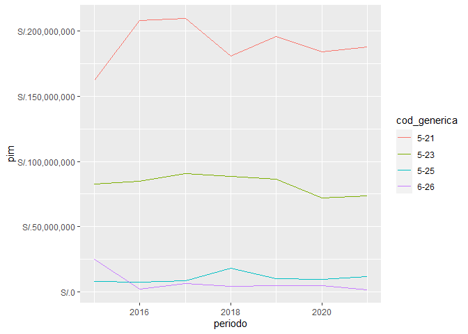

<!-- README.md is generated from README.Rmd. Please edit that file -->

# perutranspaeconomica

<!-- badges: start -->


[](https://app.codecov.io/gh/calderonsamuel/perutranspaeconomica?branch=main)
[](https://CRAN.R-project.org/package=perutranspaeconomica)
[](https://github.com/calderonsamuel/perutranspaeconomica/actions/workflows/R-CMD-check.yaml)
[](https://lifecycle.r-lib.org/articles/stages.html#stable)
<!-- badges: end -->

El objetivo de `{perutranspaeconomica}` es contar con una manera de
obtener datos del Portal de Transparencia Económica Perú desde R, con
una interfaz de programación consistente y clara.

## Code of Conduct

Please note that the perutranspaeconomica project is released with a
[Contributor Code of
Conduct](https://contributor-covenant.org/version/2/1/CODE_OF_CONDUCT.html).
By contributing to this project, you agree to abide by its terms.

## Instalación

Puedes instalar el paquete desde mi
[R-universe](https://calderonsamuel.r-universe.dev/):

``` r
# Habilita el repositorio calderonsamuel
options(repos = c(
  calderonsamuel = 'https://calderonsamuel.r-universe.dev',
  CRAN = 'https://cloud.r-project.org'))

# Descargar e instalar perutranspaeconomica en R
install.packages('perutranspaeconomica')
```

También puedes instalar la versión en desarrollo de
`{perutranspaeconomica}` desde [GitHub](https://github.com/) con:

``` r
# install.packages("remotes")
remotes::install_github("calderonsamuel/perutranspaeconomica", "devel")
```

## Ejemplo

Con este paquete puedes realizar consultas del Portal de Transparencia
Económica del MEF-Perú, específicamente en el [módulo de gasto de
seguimiento a la ejecución
presupuestal](https://www.mef.gob.pe/es/?option=com_content&language=es-ES&Itemid=100944&lang=es-ES&view=article&id=504).

El paquete propone un flujo de trabajo de 1) iniciar consulta, 2) elegir
parámetros, y 3) ejecutar consulta. Para ello, se ha creado la clase
‘sep_df’ para consolidar una infraestructura interna consistente. EL
usuario común no va a necesitar interactuar con esa infraestructura
directamente ya que se han agregado funciones de soporte que habilitan
una interfaz de programación más amigable.

Empezamos por cargar el paquete:

``` r
library(perutranspaeconomica)
```

### Iniciar consulta

Para iniciar una consulta tan solo hace falta usar la función
`iniciar_transparencia_economica()`. Esto crea un dataframe vacío y
muestra los parámetros de consulta agregados. Al inicio no tenemos
parámetros ni data.

``` r
iniciar_transparencia_economica()
#> 
#> ── Seguimiento al gasto presupuestal (actualizacion diaria) ────────────────────
#> 
#> ── Parametros de consulta ──
#> 
#> ── Data ──
#> 
#> ℹ No se ha ejecutado ninguna consulta
```

### Elegir parámetros de consulta

La elección de parámetros de consulta se hace con las funciones que
`elegir_*()`. Por ejemplo, para consultas en el módulo de gasto
presupuestal, se pueden utilizar las siguientes:

- `elegir_periodo_anual()`
- `elegir_quien_gasta()`
- `elegir_en_que_se_gasta()`
- `elegir_como_se_estructura()`
- `elegir_cuando_se_hizo_gasto()`
- `elegir_donde_se_gasta()`

De todas ellas, la mínima requerida es `elegir_periodo_anual()`.

Una vez que se le agrega parámetros a la consulta, la interfaz lo
refleja.

``` r
iniciar_transparencia_economica() |> 
    elegir_periodo_anual(periodo = 2023)
#> 
#> ── Seguimiento al gasto presupuestal (actualizacion diaria) ────────────────────
#> 
#> ── Parametros de consulta ──
#> 
#> • Periodo anual: 2023
#> 
#> ── Data ──
#> 
#> ℹ No se ha ejecutado ninguna consulta
```

Cada argumento de las funciones `elegir_*()` puede aceptar vectores con
más de un elemento para una consulta más potente.

``` r
iniciar_transparencia_economica() |> 
    elegir_periodo_anual(periodo = 2020:2023)
#> 
#> ── Seguimiento al gasto presupuestal (actualizacion diaria) ────────────────────
#> 
#> ── Parametros de consulta ──
#> 
#> • Periodo anual: 2020, 2021, 2022, and 2023
#> 
#> ── Data ──
#> 
#> ℹ No se ha ejecutado ninguna consulta
```

Sin embargo, en el resto de parámetros, es necesario que al menos un
argumento esté definido como `"todos"`. Más adelante se verá que en caso
contrario la consulta no prosperará.

``` r
iniciar_transparencia_economica() |> 
    elegir_periodo_anual(periodo = 2023) |> 
    elegir_quien_gasta(nivel = "E") |> 
    elegir_donde_se_gasta(departamento_meta = "todos") # <- aquí se usó "todos"
#> 
#> ── Seguimiento al gasto presupuestal (actualizacion diaria) ────────────────────
#> 
#> ── Parametros de consulta ──
#> 
#> • Periodo anual: 2023
#> • Nivel de gobierno: E
#> • Departamento (meta): *todos*
#> 
#> ── Data ──
#> 
#> ℹ No se ha ejecutado ninguna consulta
```

Todos los métodos `elegir_*()` cuentan con documentación referente a
cómo deben ser definidos. Para mayor detalle consultar el método
específico. Por ejemplo, `help("elegir_quien_gasta")` o
`?elegir_quien_gasta`.

La elección de parámetros no prosperará si se intenta definir más de un
parámetro como “todos”.

``` r
iniciar_transparencia_economica() |> 
    elegir_periodo_anual(2022) |> 
    elegir_quien_gasta(nivel = "todos") |> 
    elegir_donde_se_gasta(departamento_meta = "todos")
#> Error: <transpaeco> object is invalid:
#> - Debe haber solo una propiedad con valor "todos"
```

### Consultar

Una vez definidos los parámetros de la consulta, solo hace falta
ejecutarla. Para ello, usamos la función `consultar()`. Esto nos
devolverá la interfaz de consulta, pero ahora contendrá la data
requerida.

``` r
# ¿Cuál fue la ejecución presupuestal por departamento en el gobierno nacional?
# Para el año 2022
iniciar_transparencia_economica() |> 
    elegir_periodo_anual(2022) |> 
    elegir_quien_gasta(nivel = "E") |> 
    elegir_donde_se_gasta(departamento_meta = "todos") |> 
    consultar()
#> ℹ Iniciando consulta
#> ℹ Unificando consultas...
#> ✔ Consultas realizadas y unificadas
#> 
#> ── Seguimiento al gasto presupuestal (actualizacion diaria) ────────────────────
#> 
#> ── Parametros de consulta ──
#> 
#> • Periodo anual: 2022
#> • Nivel de gobierno: E
#> • Departamento (meta): *todos*
#> 
#> ── Data ──
#> 
#>    periodo cod_departamento_meta              desc_departamento_meta
#> 1     2022                    01                            AMAZONAS
#> 2     2022                    02                              ANCASH
#> 3     2022                    03                            APURIMAC
#> 4     2022                    04                            AREQUIPA
#> 5     2022                    05                            AYACUCHO
#> 6     2022                    06                           CAJAMARCA
#> 7     2022                    07 PROVINCIA CONSTITUCIONAL DEL CALLAO
#> 8     2022                    08                               CUSCO
#> 9     2022                    09                        HUANCAVELICA
#> 10    2022                    10                             HUANUCO
#> 11    2022                    11                                 ICA
#> 12    2022                    12                               JUNIN
#> 13    2022                    13                         LA LIBERTAD
#> 14    2022                    14                          LAMBAYEQUE
#> 15    2022                    15                                LIMA
#> 16    2022                    16                              LORETO
#> 17    2022                    17                       MADRE DE DIOS
#> 18    2022                    18                            MOQUEGUA
#> 19    2022                    19                               PASCO
#> 20    2022                    20                               PIURA
#> 21    2022                    21                                PUNO
#> 22    2022                    22                          SAN MARTIN
#> 23    2022                    23                               TACNA
#> 24    2022                    24                              TUMBES
#> 25    2022                    25                             UCAYALI
#> 26    2022                    98                            EXTERIOR
#>            pia         pim certificacion compromiso_anual
#> 1   1026961229  1036603224    1019703841       1007917601
#> 2   3370293981  3090764446    2886362233       2848542393
#> 3    913487069  1056138157    1028591184        996935612
#> 4   2194091165  2182499337    2150397980       2123511421
#> 5   1143902497  1308311327    1289719892       1270923838
#> 6   2028783866  2244212440    2207738181       2178480992
#> 7   2722057629  3137067599    3066951278       3022627126
#> 8   3202051537  3459628234    3301192803       3253267313
#> 9   1055636433   898295157     868561149        852173872
#> 10  1637411255  1513569251    1486228937       1478539677
#> 11  1563228701  1501730697    1435999821       1423372294
#> 12  1839584205  1939358462    1904391807       1892686043
#> 13  3143198012  2370763552    2280934866       2258199942
#> 14  1973010032  1848967903    1796212495       1774102577
#> 15 97099752847 92530549889   87897759849      87283575771
#> 16  1264287566  1636643964    1572372346       1549778963
#> 17   604705825   616889180     608683618        606236568
#> 18   594424997   532127236     509946377        503666935
#> 19   563962120   625398557     617275290        612390385
#> 20  2815557498  3849595955    3762233327       3700128949
#> 21  2703416243  2744055936    2705975930       2689348480
#> 22  1094794192  1555403879    1530987176       1525635415
#> 23   861212211   752787128     713586819        701033273
#> 24  2224007521   754886140     738817357        730471894
#> 25   700996975   751445393     727424322        721201061
#> 26   758393689   863284172     857477729        847741942
#>    atencion_de_compromiso_mensual   devengado      girado avance_percent nivel
#> 1                      1003409898   999855594   996207868           96.5     E
#> 2                      2845717979  2839917935  2826199920           91.9     E
#> 3                       993869137   982777454   979585091           93.1     E
#> 4                      2122678949  2121333487  2116700001           97.2     E
#> 5                      1265976598  1263691742  1259608785           96.6     E
#> 6                      2162521733  2160398299  2150975314           96.3     E
#> 7                      3013375692  3011916290  3007735559           96.0     E
#> 8                      3245744287  3243047790  3233344767           93.7     E
#> 9                       848590692   848393853   845717118           94.4     E
#> 10                     1475112099  1471209527  1466651678           97.2     E
#> 11                     1421314432  1419639756  1416439356           94.5     E
#> 12                     1888351903  1886999754  1876680505           97.3     E
#> 13                     2253257637  2251684245  2238642982           95.0     E
#> 14                     1771081518  1770746387  1765822188           95.8     E
#> 15                    87160571254 87074015084 86889539360           94.1     E
#> 16                     1539524338  1530487863  1521208194           93.5     E
#> 17                      605330423   605234132   603564506           98.1     E
#> 18                      503384955   503159303   502025888           94.6     E
#> 19                      609378839   605519671   603863610           96.8     E
#> 20                     3692838873  3683522218  3675015213           95.7     E
#> 21                     2684740400  2678825596  2669412816           97.6     E
#> 22                     1523636892  1521096526  1517403920           97.8     E
#> 23                      696939213   692520046   690834892           92.0     E
#> 24                      728375097   728143484   727500085           96.5     E
#> 25                      720863499   720424963   715893885           95.9     E
#> 26                      847741942   847713116   846078615           98.2     E
#>    departamento_meta
#> 1              todos
#> 2              todos
#> 3              todos
#> 4              todos
#> 5              todos
#> 6              todos
#> 7              todos
#> 8              todos
#> 9              todos
#> 10             todos
#> 11             todos
#> 12             todos
#> 13             todos
#> 14             todos
#> 15             todos
#> 16             todos
#> 17             todos
#> 18             todos
#> 19             todos
#> 20             todos
#> 21             todos
#> 22             todos
#> 23             todos
#> 24             todos
#> 25             todos
#> 26             todos
```

Se recomienda asignarle nombre a una consulta ejecutada para evitar
posibles tediosas re-descargas, especialmente cuando la consulta usa
parámetros con vectores más grandes.

``` r
# ¿Cómo se ejecutó el gasto por genérica para el PP 0031 entre el 2015 y 2021?
mi_consulta <- iniciar_transparencia_economica() |> 
    elegir_periodo_anual(2015:2021) |> 
    elegir_en_que_se_gasta(categoria_presupuestal = "0031") |> 
    elegir_como_se_estructura(generica = "todos") |> 
    consultar()
#> ℹ Iniciando consulta
#> ⠙ 2/7 ETA:  5s | Ejecutando consulta  ⠹ 3/7 ETA:  4s | Ejecutando consulta  ⠸ 4/7 ETA:  3s | Ejecutando consulta  ⠼ 5/7 ETA:  2s | Ejecutando consulta  ⠴ 6/7 ETA:  1s | Ejecutando consulta                                         ℹ Unificando consultas...
#> ✔ Consultas realizadas y unificadas

mi_consulta
#> 
#> ── Seguimiento al gasto presupuestal (actualizacion diaria) ────────────────────
#> 
#> ── Parametros de consulta ──
#> 
#> • Periodo anual: 2015, 2016, 2017, 2018, 2019, 2020, and 2021
#> • Categoria Presupuestal: 0031
#> • Generica: *todos*
#> 
#> ── Data ──
#>    periodo cod_generica                         desc_generica       pia
#> 1     2015         5-21      PERSONAL Y OBLIGACIONES SOCIALES 161861223
#> 2     2015         5-23                    BIENES Y SERVICIOS 104378682
#> 3     2015         5-25                          OTROS GASTOS   7000000
#> 4     2015         6-26 ADQUISICION DE ACTIVOS NO FINANCIEROS  26120000
#> 5     2016         5-21      PERSONAL Y OBLIGACIONES SOCIALES 208112423
#> 6     2016         5-23                    BIENES Y SERVICIOS  79975551
#> 7     2016         5-25                          OTROS GASTOS   7000000
#> 8     2016         6-26 ADQUISICION DE ACTIVOS NO FINANCIEROS         0
#> 9     2017         5-21      PERSONAL Y OBLIGACIONES SOCIALES 209308943
#> 10    2017         5-23                    BIENES Y SERVICIOS  84184599
#> 11    2017         5-25                          OTROS GASTOS   7060000
#> 12    2017         6-26 ADQUISICION DE ACTIVOS NO FINANCIEROS  22697222
#> 13    2018         5-21      PERSONAL Y OBLIGACIONES SOCIALES 180890881
#> 14    2018         5-23                    BIENES Y SERVICIOS  84175332
#> 15    2018         5-25                          OTROS GASTOS   8694280
#> 16    2018         6-26 ADQUISICION DE ACTIVOS NO FINANCIEROS   7420992
#> 17    2019         5-21      PERSONAL Y OBLIGACIONES SOCIALES 200538695
#> 18    2019         5-23                    BIENES Y SERVICIOS  79393332
#> 19    2019         5-25                          OTROS GASTOS   8620769
#> 20    2019         6-26 ADQUISICION DE ACTIVOS NO FINANCIEROS   3941456
#> 21    2020         5-21      PERSONAL Y OBLIGACIONES SOCIALES 183923246
#> 22    2020         5-23                    BIENES Y SERVICIOS  68922677
#> 23    2020         5-25                          OTROS GASTOS   8606000
#> 24    2020         6-26 ADQUISICION DE ACTIVOS NO FINANCIEROS   5026164
#> 25    2021         5-21      PERSONAL Y OBLIGACIONES SOCIALES 187837669
#> 26    2021         5-23                    BIENES Y SERVICIOS  66802985
#> 27    2021         5-25                          OTROS GASTOS   8580000
#> 28    2021         6-26 ADQUISICION DE ACTIVOS NO FINANCIEROS         0
#>          pim certificacion compromiso_anual atencion_de_compromiso_mensual
#> 1  161903973     161903968        161903968                      161903968
#> 2   82452503      78873581         77855263                       77855263
#> 3    7929714       7929712          7927213                        7927213
#> 4   25065173      22911882         22856652                       22856652
#> 5  208113793     208113793        208113793                      208113793
#> 6   84693810      84200881         82404677                       82404677
#> 7    7454915       7448352          7214068                        7214068
#> 8    2147869       2146782          1319582                        1319582
#> 9  209308943     209308943        209308943                      209308943
#> 10  90776651      88905681         87661656                       87661656
#> 11   8911638       8889389          8889051                        8889051
#> 12   6631684       5144360          4797360                        4797360
#> 13 180890881     180890881        180890881                      180890881
#> 14  88629122      85057102         84636834                       84636834
#> 15  18200236      18196005         18196005                       18196005
#> 16   4347150       1879309          1675809                        1675809
#> 17 195441649     195441649        195441649                      195441649
#> 18  86682064      81931083         81468122                       81438604
#> 19  10017098      10017097         10017097                       10017097
#> 20   4728225       4347658          3894715                        3894715
#> 21 183923246     183923246        183923246                      183923246
#> 22  71942898      68308945         67461282                       67369167
#> 23   9722522       9708084          9704883                        9704883
#> 24   5146460       4997061          4984428                        4984428
#> 25 187842487     187842487        187842487                      187842468
#> 26  73710512      71947458         71115268                       70999611
#> 27  12018416      12018415          8900472                        8900472
#> 28   2017290       1644658          1616287                        1382155
#>    devengado    girado avance_percent categoria_presupuestal generica
#> 1  161903968 161903968          100.0                   0031    todos
#> 2   77841364  77531404           94.4                   0031    todos
#> 3    7927213   7927213          100.0                   0031    todos
#> 4   22842173  22842173           91.1                   0031    todos
#> 5  208113793 208113793          100.0                   0031    todos
#> 6   82402138  82081846           97.3                   0031    todos
#> 7    7214068   7214068           96.8                   0031    todos
#> 8    1319582   1312086           61.4                   0031    todos
#> 9  209308943 209308943          100.0                   0031    todos
#> 10  87660157  87346043           96.6                   0031    todos
#> 11   8889051   8889051           99.7                   0031    todos
#> 12   4797360   4797360           72.3                   0031    todos
#> 13 180890881 180890881          100.0                   0031    todos
#> 14  84636834  84468376           95.5                   0031    todos
#> 15  18196005  18196005          100.0                   0031    todos
#> 16   1675809   1675809           38.6                   0031    todos
#> 17 195441649 195441649          100.0                   0031    todos
#> 18  81408634  81260303           93.9                   0031    todos
#> 19  10017097  10017097          100.0                   0031    todos
#> 20   3894715   3894715           82.4                   0031    todos
#> 21 183923246 183923246          100.0                   0031    todos
#> 22  67117396  67044942           93.3                   0031    todos
#> 23   9704883   9531867           99.8                   0031    todos
#> 24   4984428   4984428           96.9                   0031    todos
#> 25 187842468 187842468          100.0                   0031    todos
#> 26  70993305  70932992           96.3                   0031    todos
#> 27   8900472   8897135           74.1                   0031    todos
#> 28   1240129   1240129           61.5                   0031    todos
```

Una vez obtenida la consulta requerida, es posible tratar los datos
obtenidos como cualquier otro dataframe en R. Por ejemplo, para calcular
el porcentaje de presupuesto destinado a personal y obligaciones
sociales por periodo anual.

``` r
library(dplyr)

mi_consulta |> 
    group_by(periodo) |> 
    mutate(porc_presupuesto = (pim/sum(pim)*100) |> round(1)) |> 
    ungroup() |> 
    filter(desc_generica == "PERSONAL Y OBLIGACIONES SOCIALES")
#> # A tibble: 7 × 14
#>   periodo cod_generica desc_generica                          pia       pim
#>     <int> <chr>        <chr>                                <dbl>     <dbl>
#> 1    2015 5-21         PERSONAL Y OBLIGACIONES SOCIALES 161861223 161903973
#> 2    2016 5-21         PERSONAL Y OBLIGACIONES SOCIALES 208112423 208113793
#> 3    2017 5-21         PERSONAL Y OBLIGACIONES SOCIALES 209308943 209308943
#> 4    2018 5-21         PERSONAL Y OBLIGACIONES SOCIALES 180890881 180890881
#> 5    2019 5-21         PERSONAL Y OBLIGACIONES SOCIALES 200538695 195441649
#> 6    2020 5-21         PERSONAL Y OBLIGACIONES SOCIALES 183923246 183923246
#> 7    2021 5-21         PERSONAL Y OBLIGACIONES SOCIALES 187837669 187842487
#> # ℹ 9 more variables: certificacion <dbl>, compromiso_anual <dbl>,
#> #   atencion_de_compromiso_mensual <dbl>, devengado <dbl>, girado <dbl>,
#> #   avance_percent <dbl>, categoria_presupuestal <chr>, generica <chr>,
#> #   porc_presupuesto <dbl>
```

También es posible usar los datos obtenidos directamente para un gráfico
con `ggplot2`.

``` r
library(ggplot2)

mi_consulta |> 
    ggplot(aes(periodo, pim, color = cod_generica)) +
    geom_line() +
    scale_y_continuous(labels = scales::label_dollar(prefix = "S/."))
```


